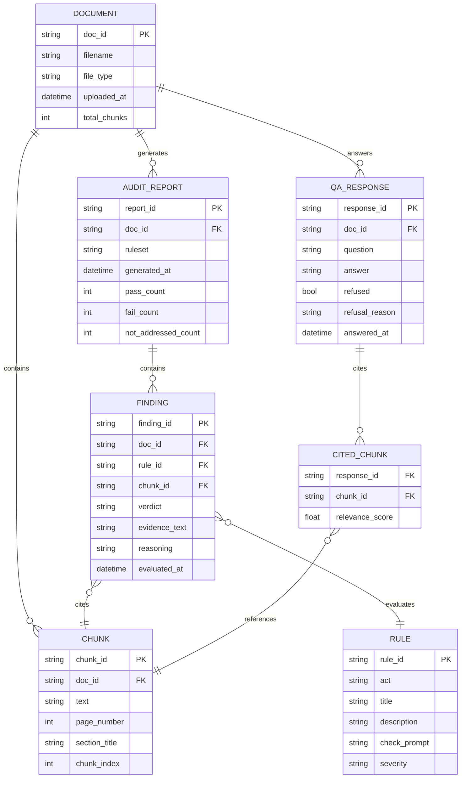
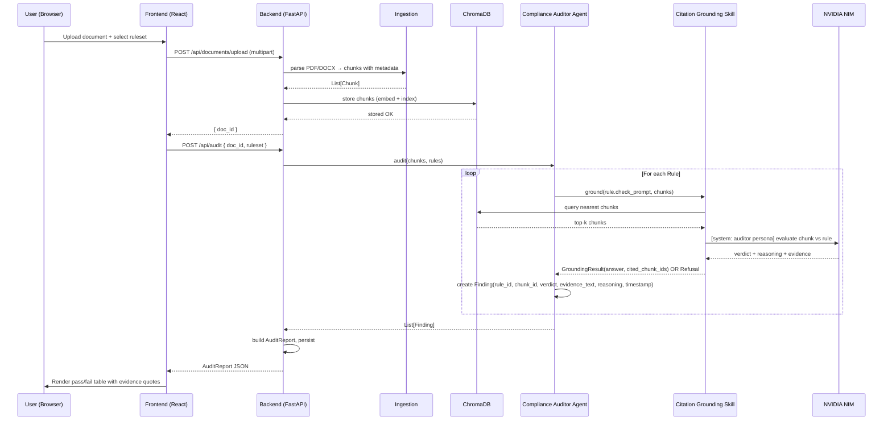
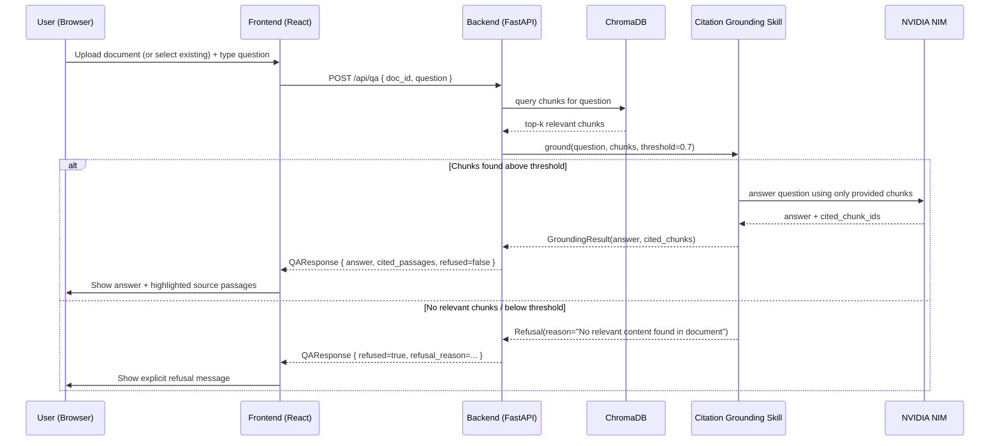

# LexAudit — Architecture

## Stack Choice

| Layer | Technology | Rationale |
|---|---|---|
| Backend | FastAPI (Python 3.11+) | Native async, Pydantic models, excellent AI/ML ecosystem, auto OpenAPI docs |
| Frontend | React + Vite + TypeScript | Fast dev server, minimal footprint, strong typing |
| Vector Store | ChromaDB (local) | No paid service, runs in-process, persistent, simple Python API |
| LLM (reasoning) | NVIDIA NIM — Llama-3.1-70B-Instruct | Free tier, strong instruction-following for legal reasoning |
| LLM (planning) | Google Gemini Flash | Permanent free tier, structured text generation |
| Document parsing | pypdf + python-docx | Pure Python, no binary deps, good metadata extraction |

### Known Limitations
- ChromaDB is local-only (not distributed). Single-node only. Acceptable for hackathon scope.
- No authentication layer — explicitly out of scope per PROJECT_MASTER §8.
- Rule library is capped at ~22 rules (15 DPDP + 7 Contract Act). Depth over breadth by design.
- LLM calls are sequential per rule (not parallelized) — acceptable latency for demo, optimize post-hackathon.

---

## Data Model

---

## Request Flow — Compliance Audit

---

## Request Flow — Grounded Q&A

---

## Audit Trail

Every `Finding` record stores:
- `chunk_id` — exact chunk used for evidence
- `evidence_text` — verbatim text from that chunk
- `reasoning` — LLM's explanation of verdict
- `evaluated_at` — ISO timestamp

This satisfies the "traceable and auditable" requirement. Reports are persisted to disk (JSON) and retrievable by `report_id`.
